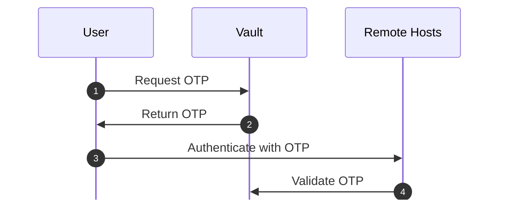

```mermaid
%%{init: { 'sequence': {'mirrorActors':false} } }%%

sequenceDiagram
autonumber
participant U as User
participant V as Vault
participant C as Remote Hosts

U->>V: Request OTP
V->>U: Return OTP
U->>C: Authenticate with OTP
C->>V: Validate OTP
```