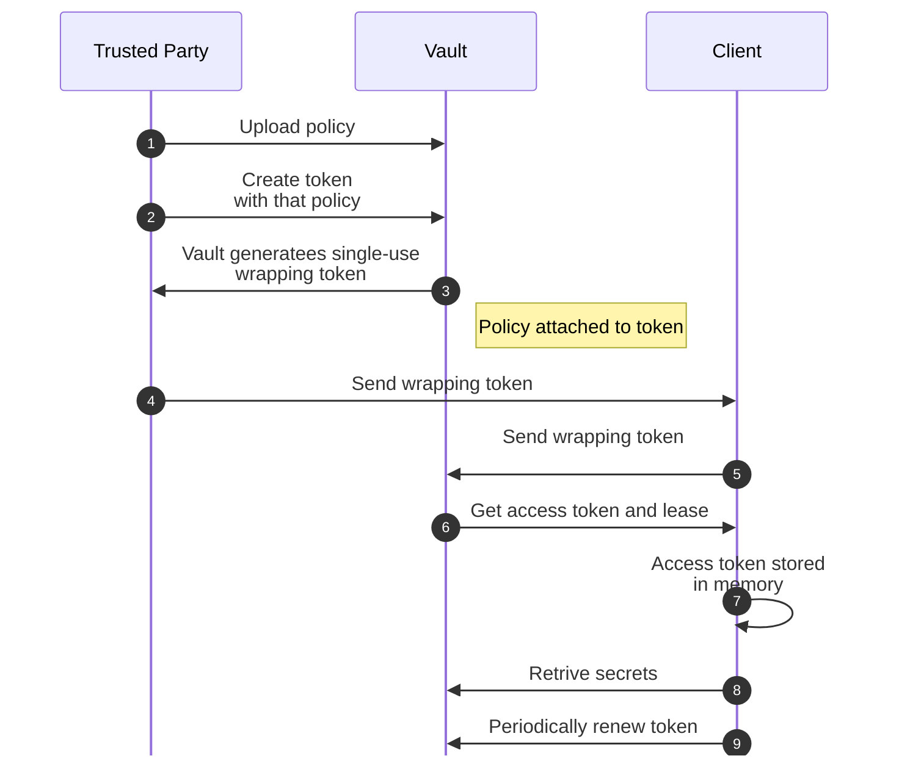

```mermaid
%%{init: { 'sequence': {'mirrorActors':false} } }%%

sequenceDiagram
autonumber
participant T as Trusted Party
participant V as Vault
participant C as Client

T->>V: Upload policy
T->>V: Create token <br/>with that policy
V->>T: Vault generatees single-use<br/>wrapping token
note right of V: Policy attached to token
T->>C: Send wrapping token
C->>V: Send wrapping token<br/>
V->>C: Get access token and lease
C->>C: Access token stored<br/> in memory
C->>V: Retrive secrets
C->>V: Periodically renew token
```